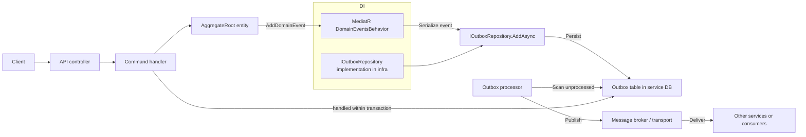

# Shared.Kernel Usage

This library provides domain primitives and a MediatR pipeline behavior to materialize Outbox messages.

Quick integration:

1. Reference the project from your service Application project.

2. Implement `Shared.Kernel.Application.Outbox.IOutboxRepository` in your Infrastructure layer and register it in DI:

   ```csharp
   services.AddScoped<Shared.Kernel.Application.Outbox.IOutboxRepository, MyService.Infrastructure.Outbox.OutboxRepository>();
   services.AddTransient(typeof(MediatR.IPipelineBehavior<,>), typeof(Shared.Kernel.Application.MediatR.DomainEventsBehavior<,>));
   ```

3. Make aggregate entities inherit from `Shared.Kernel.Domain.AggregateRoot` and call `AddDomainEvent(new MyEvent(...))` when noteworthy actions occur.

4. Use a stable JSON serializer for Outbox message content. Services should persist Outbox messages within the same DB transaction as aggregate changes.

Mermaid flow (high level)



Explanation of the flow

- Requests arrive at the API and are handled by an application command handler.
- The handler creates or updates aggregate entities deriving from [`shared/libs/Shared.Kernel/Domain/AggregateRoot.cs`](shared/libs/Shared.Kernel/Domain/AggregateRoot.cs:1) and calls AddDomainEvent to record domain events.
- MediatR executes the handler and the registered pipeline behavior [`shared/libs/Shared.Kernel/Application/MediatR/DomainEventsBehavior.cs`](shared/libs/Shared.Kernel/Application/MediatR/DomainEventsBehavior.cs:1) runs after the handler completes. The behavior finds domain events, serializes them to JSON and creates `OutboxMessage` instances.
- The behavior calls the service-provided implementation of [`shared/libs/Shared.Kernel/Application/Outbox/IOutboxRepository.cs`](shared/libs/Shared.Kernel/Application/Outbox/IOutboxRepository.cs:1) to persist outbox entries in the local database table. Persisting should happen in the same DB transaction as aggregate state changes to guarantee atomicity.
- A background worker scans the outbox table for unprocessed messages, publishes them to a message broker, and marks them processed.

Files to inspect

- Domain primitives: [`shared/libs/Shared.Kernel/Domain/Entity.cs`](shared/libs/Shared.Kernel/Domain/Entity.cs:1) and [`shared/libs/Shared.Kernel/Domain/AggregateRoot.cs`](shared/libs/Shared.Kernel/Domain/AggregateRoot.cs:1)
- Domain events: [`shared/libs/Shared.Kernel/Domain/Events/IDomainEvent.cs`](shared/libs/Shared.Kernel/Domain/Events/IDomainEvent.cs:1)
- Outbox model and repository contract: [`shared/libs/Shared.Kernel/Application/Outbox/OutboxMessage.cs`](shared/libs/Shared.Kernel/Application/Outbox/OutboxMessage.cs:1) and [`shared/libs/Shared.Kernel/Application/Outbox/IOutboxRepository.cs`](shared/libs/Shared.Kernel/Application/Outbox/IOutboxRepository.cs:1)
- Pipeline behavior: [`shared/libs/Shared.Kernel/Application/MediatR/DomainEventsBehavior.cs`](shared/libs/Shared.Kernel/Application/MediatR/DomainEventsBehavior.cs:1)


