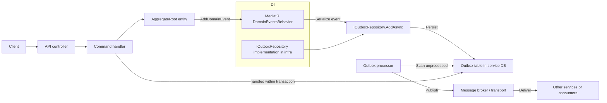

Explanation:

- API receives request and dispatches a command to the application layer.
- Command handler applies domain changes to AggregateRoot and records domain events.
- DomainEventsBehavior materializes recorded domain events into OutboxMessage and calls IOutboxRepository.AddAsync.
- OutboxMessage records are persisted to the service-local Outbox table within the same transaction as aggregate changes.
- A BackgroundWorker scans the Outbox table, publishes messages to a message broker, and marks them processed.

